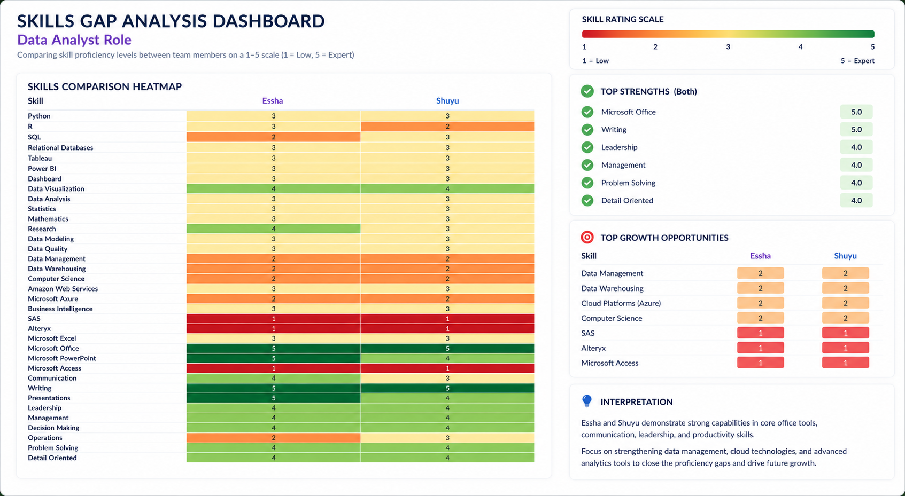
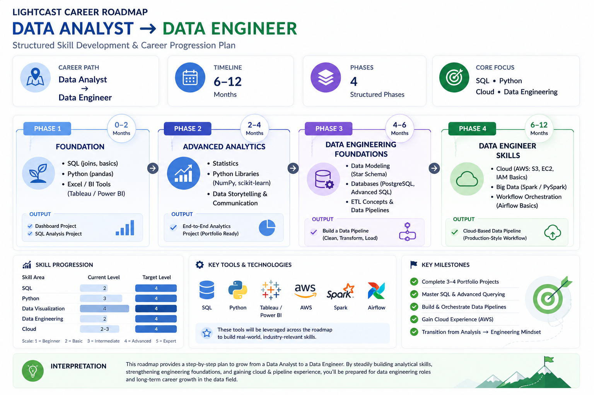

Based on our exploratory data analysis (EDA) of skills, we identified key software, specialized, and soft skills within the dataset. Using these insights, Shuyu and I evaluated our own skill levels against the requirements for a Data Analyst role, which allowed us to identify our strengths as well as areas for improvement.

## **Improvement Plan**

**Skill Prioritization**

Essha: SQL, data warehousing, cloud application (Azure), technical depth.

Shuyu: R programming, communication/presentation, data engineering.

Both: Strengthen SQL and applied analytics

**Courses & Resources**

DataCamp: Intermediate SQL, Data Engineering, Statistical Thinking

LeetCode: SQL practice (SQL 50)

Kaggle Datasets

Coursera: Google Data Engineering, AWS fundamentals

**Team Collaboration**

Peer learning (Essha: visualization | Shuyu: SQL/technical)

Weekly SQL practice and review

Build one end-to-end project (data → analysis → dashboard)

Rotate roles to develop balanced skill sets

## **Career Roadmaps**

